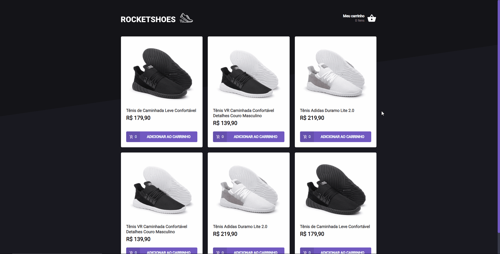

<br />
<br />
<h1> 𝗥𝗼𝗰𝗸𝗲𝘁𝘀𝗲𝗮𝘁 𝗜𝗴𝗻𝗶𝘁𝗲 (𝗥𝗲𝗮𝗰𝘁𝗝𝗦) </h1>
<p>🔎 About: e-commerce website specialized in footwear.</p>

<div align="center">
  <a href="#technologies">Technologies</a>&nbsp;&nbsp;&nbsp;|&nbsp;&nbsp;&nbsp;
  <a href="#how-to-use">How To Use</a>
</div>

<h2>👀 𝗣𝗿𝗲𝘃𝗶𝗲𝘄</h2>


<h2 id="technologies">⚙️ 𝗧𝗲𝗰𝗵𝗻𝗼𝗹𝗼𝗴𝗶𝗲𝘀</h2>

<ul>
  <li>ReactJS</li>
  <li>Typescript</li>
  <li>React router</li>
  <li>Axios</li>
  <li>Styled components</li>
  <li>React icons</li>
</ul>

<h2 id="how-to-use">📌 𝗛𝗼𝘄 𝗧𝗼 𝗨𝘀𝗲</h2>

```bash
# Clone this repository
$ git clone https://github.com/LeonardoYz/Rocketshoes.git

# Go into the repository
$ cd Rocketshoes

# Install dependencies
$ yarn install

# Run the application
$ yarn start
```